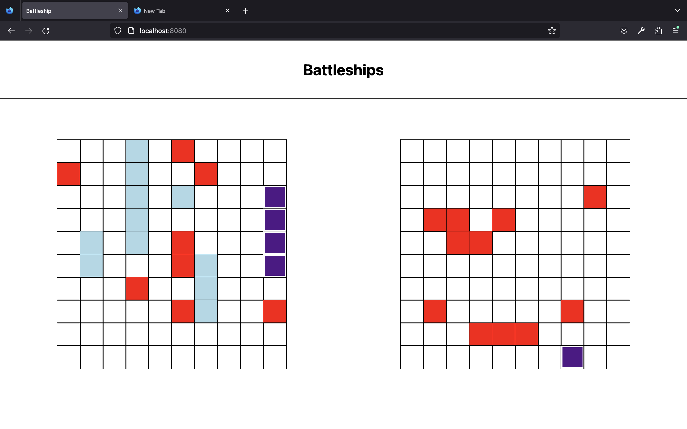

# battleship
This is the battleship project from theodinproject.com (link to the assignment: https://www.theodinproject.com/lessons/node-path-javascript-battleship)

What i learned: 
- I learned the basics of unit testing using jest
- I improved on writing algorithms, which i did by implementing smarter AI. Now, when ai will hit a field
with a ship on it, next time it will hit adjacent fields the same way a human would do.
- I have improved on writing less coupled code...

What i want to improve:
- Because i spend A LOT of time decoupling it because at one point, i went straight into rogue coding. I should definitely try to avoid this state, because it without lot of experience it lead to poor quality code, and in effect i spend more time fixing all of it. After trying to decouple and clean the code, it is better then before but obviusly far from perfect.
- I want to improve my UI design and implementation, although the simple layout and design is kind of a choice i made. Mostly because i want to move with the course, there is so much to learn!
- I definitely want to improve the responsivness off my designs, but i know there are upcoming lessons on the odin project about that. 

Overall, i see a lot of improvement, when compared to older projects like tic-tac-toe or todo list. Mostly in my headspace, as i am not as much overwhelmed when thinking about the project requirements at the beginnig asi was before. A very valuable lesson. 

Now to advanced html/css lessons, and after that the new REACT course!!!

P.S. Thank you to all theodinproject.com contributors. You guys are doing an amazing job and you really changed my life! I will make sure to give back to the community one day.